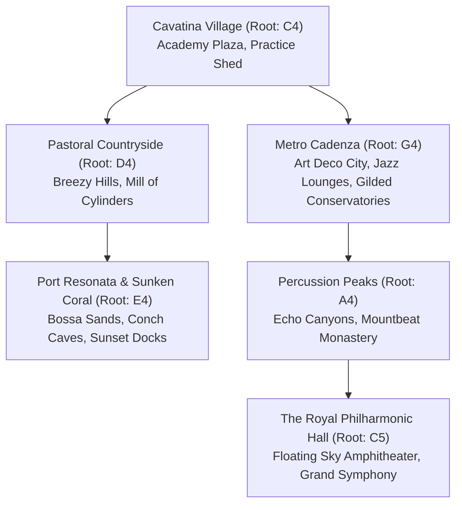
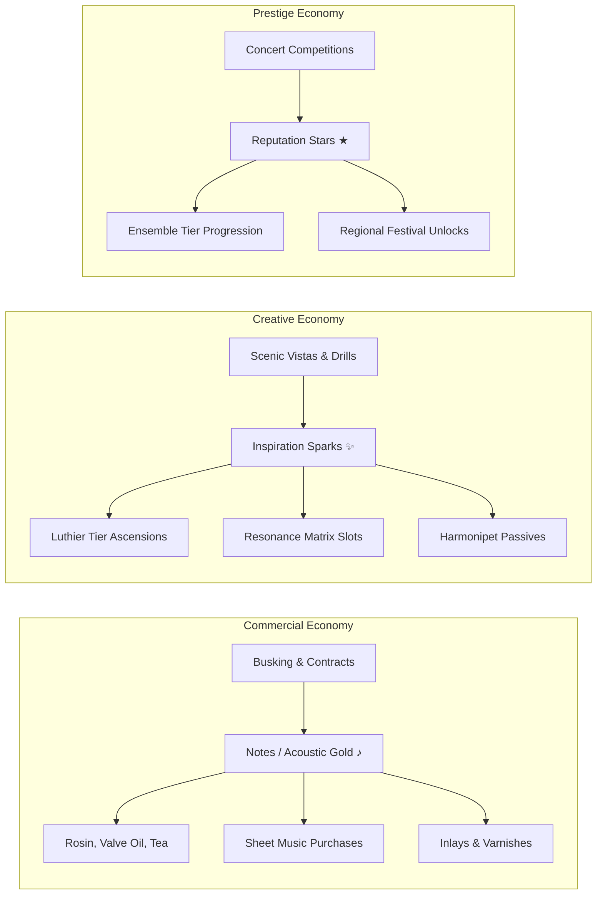

# Harmonia: Opus of the Ensemble 🎼🐾
*Master Game Design Document: Exploration, Economy, Repertoire, and Orchestral Progression*

---

## 1. Outerworld Exploration: When, How, and Why

In the world of **Sonora**, music is environmental physics. Exploration is driven by organic acoustic phenomena rather than generic map markers:

### Why Explore?
1. **Finding Lost Scores & Fragmented Folios**: The legendary works of the *First Maestro* were torn and scattered during the Great Discord. Gathering torn sheet music folios across ancient pavilions, sunken vaults, and bell towers unlocks playable masterworks for your ensemble.
2. **Meeting Secluded Musicians & Harmonipet Familiars**: Virtuosos live in acoustically resonant hermitages (e.g., Soren the Cellist by the weeping willow, Master Kensho at Mountbeat Taiko Monastery). Recruiting them requires solving acoustic interval riddles and winning Audition Jam Duels.
3. **Acoustic 'Inspiration Vistas'**: Unique environmental landmarks (e.g., *The Canyon of Thirds*, *The Tidepool Conch Organ*, *The Bellflower Basin*) where resting and listening permanently elevates core musicianship attributes (**Technique, Tone Quality, Tempo Stability, Sight-Reading**) and unlocks modular combat motifs.
4. **Gathering Rare Tuning Artifacts & Tone Woods**: Discovering ancient amber rosin, hand-hammered cymbals, African blackwood, and silver lip plates to forge instrument ascensions at Master Luthiers.

### Exploration Mechanics
- **Tuning Monocle**: A field tool allowing players to visualize sound waves, diagnose discordant wildlife, and locate hidden resonance nodes.
- **Tuning Fork Monoliths**: Fast-travel acoustic waypoints tuned to fundamental pitches ($C_4, D_4, E_4, G_4, A_4, C_5$) that activate when harmonized by the player's instrument.
- **Acoustic Environmental Traversal**: Using specific section instruments to overcome obstacles (e.g., Percussion shockwaves shatter crystal barriers; Woodwind breath currents propel wind-gliders; String resonance reveals shimmering bridge paths; Brass fanfares awaken sleeping stone sentinels).

---

## 2. World Map Architecture & Biomes

1. **Cavatina Village & Academy Plaza ($C_4$)**:
   - Storybook starting hub with timber cottages, rose gardens, the central Practice Shed, and Busker Tim's Gazebo.
2. **Pastoral Countryside ($D_4$)**:
   - Rolling green hills, Celtic folk buskers, and *The Mill of Cylinders*—a giant wind-powered music box.
3. **Port Resonata & Sunken Coral Beach ($E_4$)**:
   - Coastal sands, nautilus conch caves, boardwalk lounges, and tidal rhythm bridges that rise and fall with the BPM.
4. **Metro Cadenza ($G_4$)**:
   - Bustling Art Deco metropolis with steam-whistle pitch elevators, underground jazz speakeasies, bustling busking avenues, and the Gilded Conservatory.
5. **Percussion Peaks & High Alpine ($A_4$)**:
   - Echoing granite gorges, stone chime suspension bridges, and the high-altitude Mountbeat Taiko Monastery.
6. **The Royal Philharmonic Hall & Sky Amphitheater ($C_5$)**:
   - Floating celestial palace of pure acoustics where 16-piece Grand Symphony showdowns crown the Grand Maestro.

---

## 3. Performance Venues & Mechanical Systems

| Venue Type | Key Examples | Acoustic Profile & Hazards | Progression Impact |
| :--- | :--- | :--- | :--- |
| **Open-Air & Busking** | Cavatina Gazebo, Cadenza Street Corners | Pedestrian ambient noise, crowd attraction mechanics. | High Gold/Notes yield, low entry barrier. |
| **Intimate Cafés & Lounges** | *The Roasted Bean Café*, *The Velvet Mute* | Dry room acoustics; clattering espresso machines and chatter hazards require sharp dynamic focus. | Unlocks local jazz & folk repertoire, coffee buffs. |
| **Chamber Salons** | *Manor Solana Salon*, Conservatory Recital Halls | High reflection, strict *Pianissimo* to *Mezzo-Forte* dynamic ceilings; fortissimo bursts cause audience cringe. | Aristocratic sponsorship, rare artifact rewards. |
| **Grand Concert Halls** | *Port Resonata Amphitheater*, *Royal Symphony Hall* | Cathedral-scale reverb decay (3.5s). Requires precise balance across all 4 instrument families. | High Reputation Stars (★), ensemble tier promotions. |

---

## 4. Multi-Tier Currency Ecosystem

1. **Notes / Acoustic Gold (♪ / AG)**:
   - *Earned*: Active street busking, café contracts, wager duels, transcribing royalties.
   - *Spent*: Maintenance items (Amber Rosin, Valve Oil, Chamomile Tea), standard sheet music, cosmetic instrument finishes.
2. **Inspiration Sparks / Harmonic Resonance (✨ / IS)**:
   - *Earned*: Discovering Inspiration Vistas, S-Rank Practice Shed drills, field analysis with the Tuning Monocle, reconstructing lost score fragments.
   - *Spent*: Master Luthier instrument ascensions (T1 $\rightarrow$ T5), Resonance Matrix gem sockets, Harmonipet talent awakenings.
3. **Reputation Stars (★ / RS)**:
   - *Earned*: Conservatory Concert Competitions and Festival Showdowns.
   - *Milestones*: ★1 (Duet Tier), ★3 (Trio Tier), ★6 (Quartet Tier), ★8 (Chamber Tier), ★10 (Grand Maestro & Royal Symphony).

---

## 5. Artifacts & Instrument Upgrade Progression

Instruments ascend through 5 tiers at the Master Luthier:
- **T1: Novice Craft** (+0% Base Power)
- **T2: Resonant Craft** (+15% Power, +5 Stats)
- **T3: Virtuoso Spec** (+30% Power, +10 Stats, 1 Matrix Socket)
- **T4: Masterwork** (+50% Power, +20 Stats, 2 Matrix Sockets)
- **T5: Legendary Opus** (+80% Power, +35 Stats, 2 Sockets + Signature Familial Trait)

### Signature Section Artifacts:
1. **🎻 Bow Rosin of the Swan (Strings)**: +15% Crit Harmony, +20 Technique. *Lyrical Vibrato*: Heals ensemble Harmony by 5% and cures tempo wobble every 4th measure. (Swan synergy boosts crit damage to $2.0\times$).
2. **🪈 Silver Embouchure Lip Plate (Woodwinds)**: +20% Tone Flow, +25 Tone Quality. *Breathless Cadenza*: Eliminates breath gauge penalties during rapid 32nd-note passages. (Finch synergy reduces wind move costs by 25%).
3. **🎺 Resonant Brass Mute (Brass)**: +25% Fortissimo Power. *Dual-Harmonic Shift*: Toggle between Open Flare (+30% attack) and Harmon Mute (AoE charm). (Terrier synergy grants ensemble dissonance immunity).
4. **🥁 Hand-Hammered Bronze Cymbals (Percussion)**: +30% Tempo Stabilization. *Sonic Dispersal Crash*: Disperses opponent buffs on Beat 1 and locks tempo meter. (Raccoon synergy generates bonus gold on syncopations).

---

## 6. Main Quest Arc & Musical Side Quests

### 5-Chapter Main Narrative:
- **Chapter 1: The Street Soloist (Cavatina Village)**: Learn fundamental phrasing in the Practice Shed, busk at the Clef Fountain, recruit Clara/Oliver in an Audition Jam, and defeat Busker Tim at the Gazebo (Rewards: +1 ★, Duet Tier).
- **Chapter 2: The Bossa Trio (Port Resonata)**: Master syncopation on coastal docks, forge Resonant tier gear with Master Luthier Marco, recruit Rhythm Rita, and win the Sunset Regatta Showdown against Duke Sterling (Rewards: +2 ★, Trio Tier).
- **Chapter 3: The Starlight Quartet (Metro Cadenza)**: Pass the Conservatory entrance exam, recruit Baron Von Brass, and conquer the 3-round Starlight Grand Prix (Rewards: +3 ★, Quartet Tier).
- **Chapter 4: The Chamber Band (Alpine Monastery & Ancient Ruins)**: Traverse Echo Canyons by resolving chord inversion gates, repair the ancient 1,000-pipe Cathedral Organ, and excavate *The Tempest Fugue* (Rewards: +4 ★, Chamber Tier).
- **Chapter 5: The Grand Symphony (The Royal Symphony Hall)**: Assemble a balanced 16-piece orchestra across all 4 families, cleanse the Great Discord, and perform *Ode to Harmony* alongside Maestro Valerius (Rewards: +5 ★, Grand Maestro Title, Sandbox Mode).

### Engaging Side Quests & World Activities:
- **Mechanical Restorations**: Align cylinder pins in broken antique music boxes; pump bellows and voice cedar plugs in historic pipe organs.
- **Discordant Wildlife Rescues**: Diagnose screeching tritone/minor 2nd hostility in beasts (e.g. Screeching Cello Bears, Frenzied Staccato Sparrows) using the Tuning Monocle and perform resolving cadences to heal them.
- **Specialized Gigs**: High-society salon recitals capped at *Mezzo-Forte*; seaside wedding serenades with walking-pace counterpoint; underground night-time busking jam duels.
